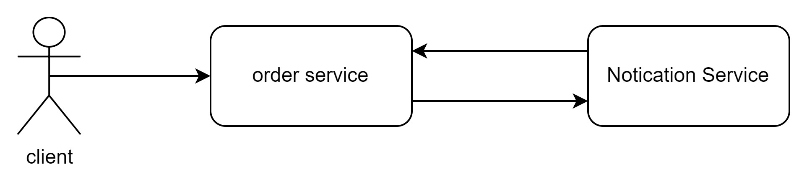
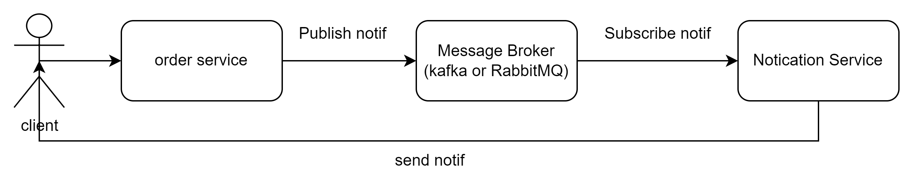

<div align="center">
  
</div>

# INTRODUCTION

Message broker is a software that acts as an intermediary in delivering messages to different applications or services. In a distributed network architecture, message brokers facilitate communication between multiple systems and applications by receiving messages from the sender and forwarding them to the intended recipient, or can be referred to as pub/sub.

Some popular examples of message brokers are **Apache Kafka** and **RabbitMQ.**

<div align="center" style="background-color: white; padding: 20px;">
  
</div>

Because everything is done synchronously, the user will wait for the request until all the processes are completed, which there is no guarantee that the order is successful, due to the many order processes carried out by the order service. We will take an example, suppose when the order service sends an email to the notif service and it turns out that the notif service is dead or down, then all transactions made will fail. This is where the message broker plays a role, the order service will send the order data to the message broker, then the message broker will send the order data to the email service and push notification service.

<div align="center" style="background-color: white; padding: 20px;">
  
</div>

Can be seen in the example above, in the message broker we will recognize the term pub / sub, where pub means publisher or who sends messages while sub means subscriber or who receives messages. usually between publishers and subscribers are divided into 2 different services. Communication between these services is no longer synchronous but can be asynchronous, one of which uses a message broker.
</br>
</br>
So the order service will only receive requests, manage data, and send order data that will be consumed by the notification service. This way, the user doesn't have to wait for the response until all processes are complete, which means the chance of success will be greater. If the notification service is down, the order service will still send the order data to the message broker, and the message broker will send the order data to the notification service when the notification service is up again.
</br>
</br>
But there is a challenge, namely when the service will be interdependent with the message broker. For example, when this message broker is down or dead, it will ensure that communication between services will be hampered. However, to overcome this, it is important to choose a stable or good message broker, one of which is Apache Kafka and RabbitMQ.

In this repository, will implement simple message broker using Apache Kafka and Golang.

# REQUIREMENTS

- Go 1.2x or higher
- Apache Kafka
- Docker
- Docker Compose

# HOW TO RUN

- Clone this repository

```bash
git clone
```

- Run docker compose

```bash
docker-compose up -d
```

- Run consumer

```bash
make order
```

- Run producer

```bash
make notif
```
